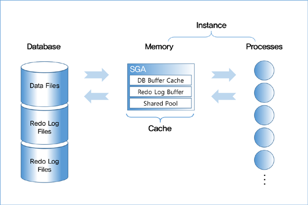
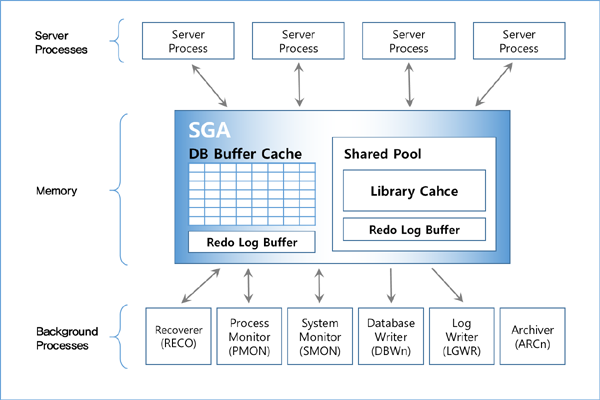

SQL 튜닝 시작전 알아 두어야 할것들
===============================

오라클 기본 구조
---------------

### 오라클 아키텍처

#### 데이터베이스 아키텍처 = 1.프로세스(Process) + 2.공유메모리 영역 + 3.디스크(물리적 파일)영역
***
#### 1. 프로세스(Process)
프로세스는 서버 프로세스와 백그라운드 프로세스로 나뉜다.

##### 서버 프로세스
> * 사용자 프로세스(클라이언트)와 통신하면서 사용자의 각종 명령어를 처리하는 프로세스
> 1. SQL을 파싱하고, 
> 2. 필요하면 최적화를 수행, 
> 3. SQL을 실행하면서 블록을 읽고, 
> 4. 읽은 데이터를 정렬하여 클라이언트가 요청한 결과를 만들어 네트워크에 전송하는 일련의 작업을 처리
> 5. 백그라운드 프로세스가 할일을 백그라운드 프로세스에게 위임시키기 위한 시스템 콜 요청

##### 백그라운드 프로세스
> * 내부적으로 DB시스템이 잘 돌아가게 해주는 역할하는 프로세스
> 1. 서버 프로세스가 하는일 외에 데이터 파일을 읽어서 DB 버퍼 캐시에 적재하는 일,
> 2. Dirty 블록(파일에 기록된 데이터와 메모리에 기록된 데이터가 다른 데이터가 존재하는 블록)을 캐시에서 제거해 Free 블록을 확보하는 일,
> 3. Redo 로그 버퍼를 비우는 일 등

> ###### 백그라운드 프로세스 요약
>|Oracle|SQL Server|설명|
>|---|---|---|
>|System Monitor(SMON)|Database clean up/ shrinking thread|장애가 발생한 시스템을 재기동할 때 복구 수행, 임시 세그먼트와 익스텐트 모니터링하는 프로세스|
>|Process Monitor(PMON)|Open Data Services(OPS)|이상이 생긴 프로세스가 사용하던 리소스 복구하기 위한 프로세스|
>|Database Writer(DBWR)|Lazywriter thread|버퍼 캐시에 있는 Dirty 버퍼(블록)를 데이터 파일에 기록하는 프로세스|
>|Log Writer(LGWR)|Log writer thread|로그 버퍼 엔트리를 Redo 로그 파일에 기록하는 프로세스|
>|Archiver(ARCn)|-|꽉찬 Redo 로그가 덮어 쓰여지기 전 Archive 로그 디렉토리에 반영|
>|Checkpoint(CKPT)|Database Checkpoint thread |Write ahead logging 방식(데이터 변경전 로그부터 쓰는 메커니즘)을 사용하는 DBMS는 Redo 로그에 기록해 둔 버퍼 블록에 대한 변경 사항 중 현재 어디까지 데이터 파일에 기록했는지(데이터 동기화)를 checkpoint로 관리하는데, 이 마지막 checkpoint 이후 로그 데이터만 디스크에 기록함으로써 인스턴스를 복구할 수 있게하는 용도로 사용되는 프로세스|
>|Recverer(RECO)|Distributed Transaction Coordinator(DTC)|분산 트랜잭션 과정에 발생한 문제를 해결하는 프로세스|
>
> ###### SMON,PMON,DBWR(DBWs),LGWR,CKPT는 5개 필수 백그라운드 프로세스

***

#### 2.공유메모리 영역 

***
#### 3.디스크(물리적 파일)영역
디스크 영역은 크게 데이터파일 + 임시 데이터파일 + 로그 파일로 구성된다.

